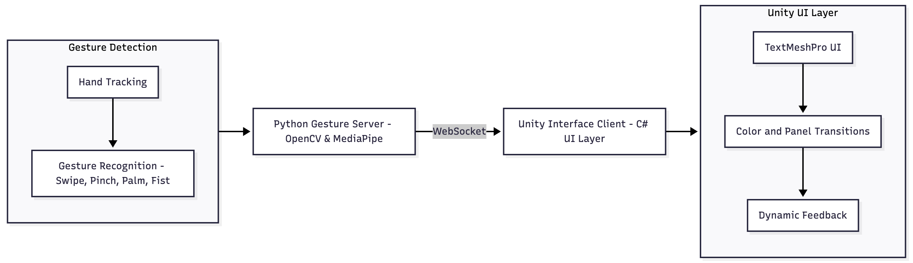

# Spatial Gesture Interface

A cross-platform prototype demonstrating real-time hand gesture recognition using **OpenCV** and **MediaPipe** in Python, integrated with a **Unity** front-end via WebSocket communication.
The system enables natural, touchless interaction through gestures such as swipe, pinch, open palm, and fist.

---

## Overview

This project combines computer vision and human–computer interaction principles to bridge real-world gestures with digital interfaces.
A Python backend handles gesture recognition and streams commands to Unity, where visual feedback, animations, and UI transitions are performed in real time.

---

## System Architecture

The following diagram illustrates the overall data flow between the Python gesture detection module and the Unity interface:

**System Architecture Diagram**



---

## Components

### Python Gesture Server

* Uses **OpenCV** and **MediaPipe** for real-time hand tracking.
* Detects key gestures including **Swipe**, **Pinch**, **Open Palm**, and **Fist**.
* Broadcasts recognized gestures to Unity via WebSocket.
* Includes a cooldown mechanism to prevent repeated gesture flooding.

### Unity Interface

* Receives gesture data and updates UI elements through the `UIManager` class.
* Implements scene transitions, color and brightness adjustments, and mode toggling.
* Uses a dispatcher pattern to ensure thread-safe UI updates.
* Supports keyboard simulation for testing without a camera.

---

## Gesture Mapping

| Gesture     | Unity Action        |
| ----------- | ------------------- |
| Swipe Up    | Show Messages       |
| Swipe Down  | Return to Home      |
| Swipe Left  | Open Settings       |
| Swipe Right | Show Notifications  |
| Pinch       | Confirm Selection   |
| Open Palm   | Toggle Dark Mode    |
| Fist        | Reset / Return Home |

---

## Setup Instructions

### Python Backend

1. Install dependencies:

   ```bash
   pip install -r requirements.txt
   ```
2. Run the gesture server:

   ```bash
   python gesture_server.py
   ```

### Unity Frontend

1. Open the `unity` folder in Unity Editor (2022.3 or newer).
2. Ensure all scripts are attached to their respective GameObjects.
3. Press **Play** to establish connection with the Python WebSocket server (`ws://127.0.0.1:8765`).

---

## Technical Highlights

* Real-time hand gesture detection via **MediaPipe Hands**.
* Non-blocking WebSocket communication between Python and Unity.
* Smooth Unity UI transitions powered by coroutine animations.
* Modular architecture allowing easy extension for new gestures or interface behaviors.
* Reliable cooldown control to minimize gesture sensitivity.

---

## Requirements

* Python 3.11+
* OpenCV 4.x
* MediaPipe
* websocket-server
* Unity 2022.3 or later
